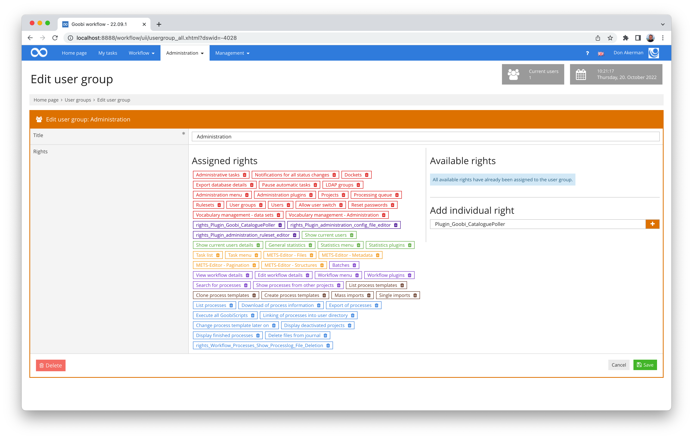
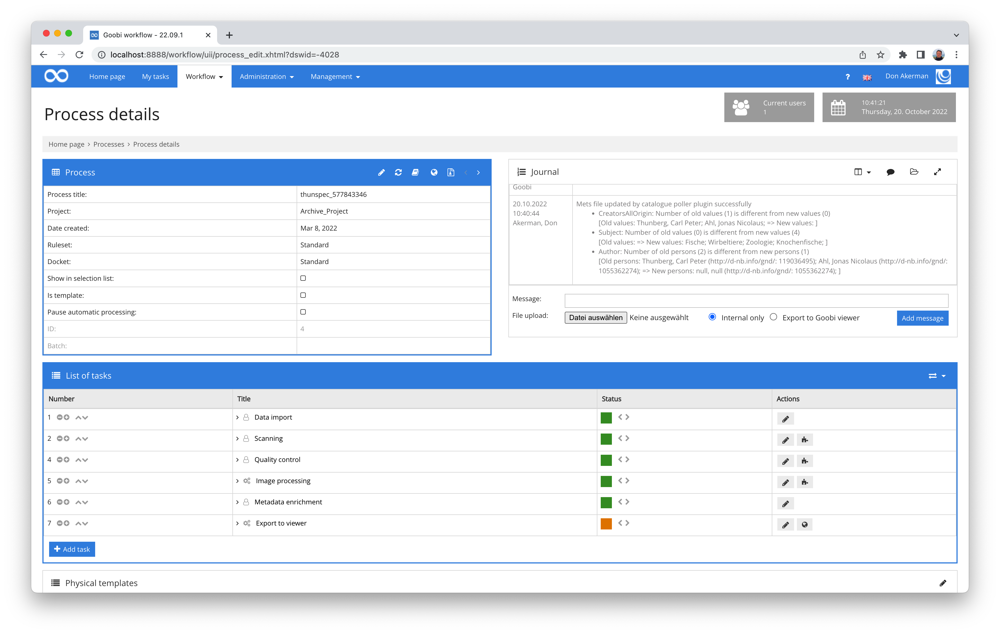

## Introduction
This documentation describes the installation, configuration and use of the Administration Plugin for automated repeated retrieval of data (e.g. from a catalog) to update records in Goobi workflow.


## Installation
The plugin consists in total of the following files to be installed

```bash
plugin-administration-data-poller-base.jar
plugin-administration-data-poller-gui.jar
plugin-administration-data-poller-job.jar
plugin-administration-data-poller-lib.jar
```

These files must be installed in the correct directories so that they are in the following paths after installation:

```bash
/opt/digiverso/goobi/plugins/administration/plugin-administration-data-poller-base.jar
/opt/digiverso/goobi/plugins/GUI/plugin-administration-data-poller-gui.jar
/opt/digiverso/goobi/plugins/GUI/plugin-administration-data-poller-job.jar
/opt/digiverso/goobi/plugins/GUI/plugin-administration-data-poller-lib.jar
```

In addition, there is a configuration file that must be located at the following location:

```bash
/opt/digiverso/goobi/config/plugin_intranda_administration_data_poller.xml
```


## Overview and functionality
The Data Poller plugin is automatically activated by Goobi. Its runtime starts at the configured start time and repeats according to the configured number of hours, e.g. every 24 hours, i.e. once a day.

If a user wants to have access to the plugin's user interface in addition to this automatic feature, he must belong to a user group that has been granted the following plugin-specific permission for this purpose:

```text
Plugin_Goobi_DataPoller
```

To assign this right, the desired user group must first have the permission entered in the right pane.



If the permission for the user group should be newly entered, the user must first log in to Goobi again to be able to use this permission level. Afterwards he can click on the plugin `Data Poller` in the menu `Administration` and there he can also manually re-trigger an update of the data records by means of a query at any time.


## Automatic backups
If the plugin finds updated metadata for an operation and therefore updates the METS file, it will first automatically create a backup of the current METS file `meta.xml` and if relevant also of `meta_anchor.xml`. The backup is stored next to the updated METS file.


## Logging within the journal
The updates of the metadata by the plugin usually take place fully automatically in the background. In order to be able to understand nevertheless at any time for a data record, what happened with this in the meantime, the events are logged. For each process for which there were changes from this plugin, detailed entries are therefore automatically inserted within the ‚journal'. In addition to the timestamp, these contain, among other things, an exact listing of the changed metadata fields together with their contents. Thus, it is possible at any time to trace the previous or the new value as well.




## Configuration
The configuration of the plugin is done via the configuration file `plugin_intranda_administration_data_poller.xml` and can be adjusted during operation. The following is an example configuration file:

{{CONFIG_CONTENT}}

### Attributes of the rule element

Attribute   | Explanation 
----------- | ----------- 
`type`      | Here the type of the `rule` can be determined. You can choose between `hotfolder` and `filter`. Depending on the type, additional parameters must be specified within the `rule`. These are described in the subsections below this table.
`title` | At this point an internal name is specified, which is mainly used for the user interface to distinguish the different rules
`startTime` | This parameter sets the start time at which the plugin should execute this rule.
`delay`     | This can be used to specify how often the plugin should be executed. The specification is made in the form of hours.
`enabled`   | The rule is executed only if the `enabled` attribute takes the value `true`.

### Subelements of the rule element

Element/Attribute        | Explanation
------------------------ | ------------
`catalogue`              | Here it is possible to define which catalogue is to be used for querying new data. This is the name of a catalogue as defined within the global Goobi catalogue configuration within `goobi_opac.xml`. `catalogue` has the subelements `fieldName` and `fieldValue`.
`fieldName`              | Is an attribute of the `catalogue` element and controls within which field the catalogue is queried. Often this value is `12`.
`fieldValue`             | Is an attribute of the `catalogue` element. Definition of the metadata from the METS file that is to be used for querying the catalogue. Usually this is the identifier that was also used for the initial catalogue query and is usually stored within the metadata `${meta.CatalogIDDigital}`.
`exportUpdatedRecords`   | If this value is set to `true`, a new data export is performed after the catalogue query for all those data records that were actually updated during the catalogue query. The data export in this case is the step that was defined as the first `export` step within the workflow for the process. This usually means the export and thus the publication of the task within the Goobi viewer. It should be noted here that the tasks are only exported if the mechanism for `mergeRecords` is also set to `true`.
`mergeRecords`          | If the value `true` is set, the existing METS file will be updated with the current data from the catalogue. Any additional metadata can be excluded for the update. Also, the logical and physical structure tree within the METS file remains unchanged. If the value is set to `false`, then the existing METS file will be completely replaced by a new METS file generated using the catalogue query.
`analyseSubElements`    | This element can be used to define whether metadata for structural elements already existing within the METS files should also be queried by the catalogue. For this purpose, the specified metadata for the identifier to be queried must be available for each subelement.
`fieldList`             | The `blacklist` and `whitelist` modes are available here. If the `whitelist` mode is selected, the metadata fields that are to be updated by a catalogue query can be defined here. If the `blacklist` mode is used, several metadata fields can be defined that should not be changed by a catalog query under any circumstances. This is especially useful for those fields that do not come from a catalogue query and were therefore previously recorded in addition to the catalogue data. Typical examples of such fields include `singleDigCollection`, `accesscondition` and `pathimagefiles`. Please note that this parameter only applies if the value for `mergeRecords` is set to `true`.
`alwaysExecuteStepList` | Here the titles of the automatic steps can be specified, which are to be executed with a run of the datapoller. The titles are located in a `step` element. Several steps can be specified.


### Additional elements/parameters - rule type filter
Parameter | Explanation
--------- | -------------
`filter`  | By means of the filter, one or more Goobi projects can be defined for which the rules defined here should apply. By using `*` the rule will apply to all projects. Spaces contained within the filter must be enclosed in quotation marks, just as they are within the Goobi interface.


### Additional elements/parameters - rule type hotfolder
Parameter                 | Explanation
------------------------- | ------------
`path`                    | Here you must specify the path of the hotfolder where the files to be imported are located.
`createMissingProcesses`  | If this switch is activated, new tasks are created for files that cannot be assigned to an existing task.|
`workflow` | Here, it can be specified which templates can be used for new processes.
`fileHandling fileFilter` | Here a regex filter can be specified to filter the filenames of the files in the hotfolder. A simple filter would be e.g. `*\.xml`. This filter would ensure that only XML files in the folder are processed.